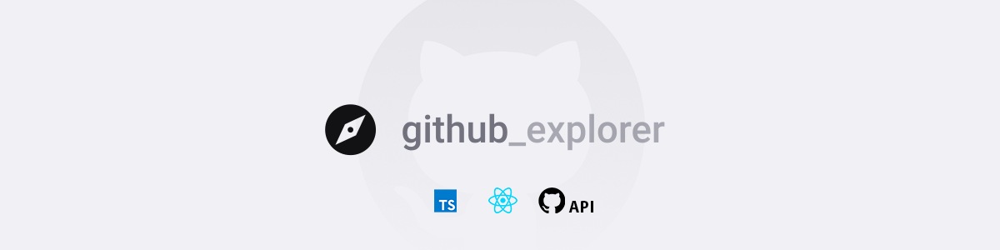
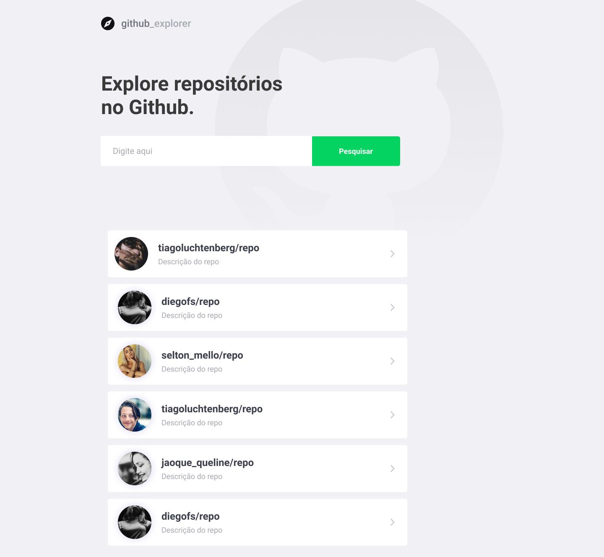
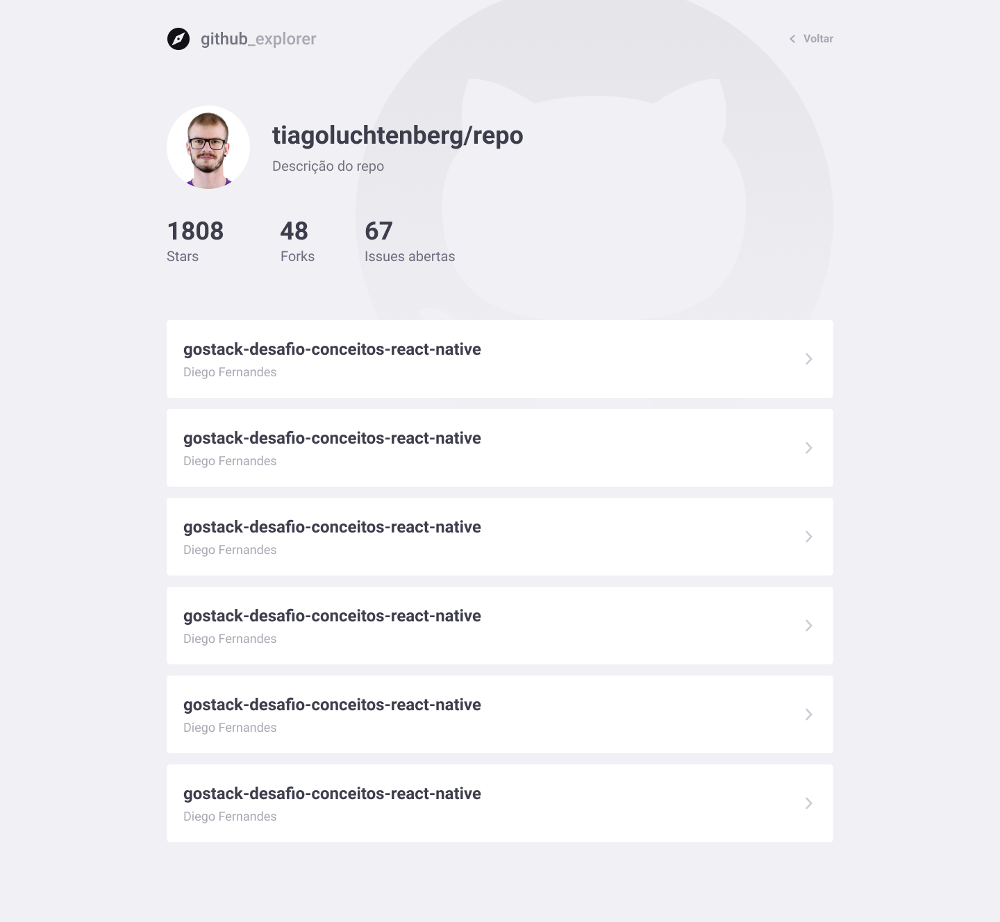

<p align="center">
  
  
  </a>
</p>

<p align="center">
  <a href="#rocket-sobre-o-desafio">Sobre o projeto</a>&nbsp;&nbsp;&nbsp;|&nbsp;&nbsp;&nbsp;
  <a href="#calendar-entrega">Tecnologias</a>&nbsp;&nbsp;&nbsp;|&nbsp;&nbsp;&nbsp;
  <a href="#calendar-entrega">Interface</a>&nbsp;&nbsp;&nbsp;|&nbsp;&nbsp;&nbsp;
  <a href="#calendar-entrega">Documentações</a>&nbsp;&nbsp;&nbsp;|&nbsp;&nbsp;&nbsp;
  <a href="#memo-licença">Licença</a>
</p>

## Sobre o Gobarber
O github_explore é uma aplicação desenvolvido em ReactJS juntamente com a API do github para armazenar repositorios.

## Tecnologias

 - [ Nodejs ]( https://nodejs.org/en/ )
 - [ ReactJS]( https://pt-br.reactjs.org/docs/getting-started.html )

 ## Interface

 <p align="center">
  
  
</p>

## Documentação

###  Como Usar

Esse projeto faz uso do **NodeJS**, antes de seguir em frente certifique-se que ele esteja instalado no meu PC.
  **Nodejs** na versão **12.14.1** ou superior.

* **Download**
  
  Para fazer o download do projeto abra o **```terminal```** e execute o comando abaixo: 
  ```
  git clone https://github.com/bhyago/github_explore.git
  ```
* **Instalando as Dependências** 

  Para instalar as dependências necessarias e gerar a pasta **```node_modules```** execute o comando:
  ```
  yarn
  ```
  ou
   ```
  npm install
  ```
  **Rodando a aplicação**

  Para rodar a aplicação no navegador execute o comando abaixo no raiz do projeto **github_explore**:

  ```
  yarn start
  ```
  ou se estiver usando npm execute o comando:
  ````
  npm start
  ```` 

 ####  Licença

  Esse projeto está sob a licença MIT. Veja o arquivo [LICENSE](LICENSE.md) para mais detalhes.

 ##### **Feito com :heart: by Hyago Braga**